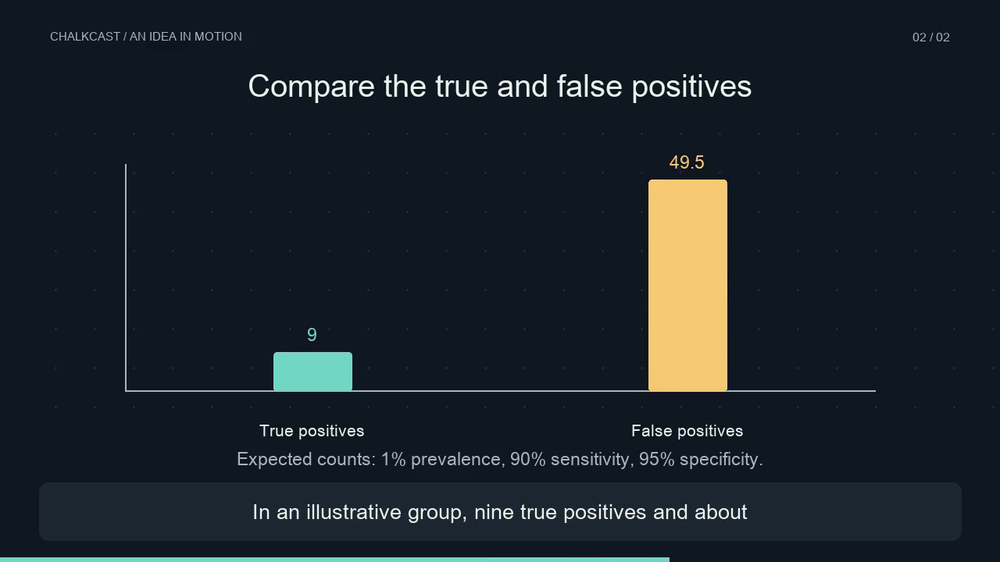

# ChalkCast

**Turn a topic into a reviewed script, geometric animation and ElevenLabs narration. Inspect the timing and cost of every scene.**

ChalkCast is a local Studio, Python CLI and small agent skill. It produces MP4, SRT and JSON reports. Original chart, flow and equation animations take their timing from measured audio, with character-aligned captions when the provider returns alignment. No generated code executes.



## Try it without a key

Python 3.11+ and [uv](https://docs.astral.sh/uv/) are required. FFmpeg comes with the Python dependency; no system encoder or LaTeX installation is needed.

```bash
git clone https://github.com/dongxu099/chalkcast.git
cd chalkcast
uv sync --extra dev
uv run chalkcast studio
```

Open **http://127.0.0.1:7860**. Load a sample, edit its narration, compare projected costs and render a silent video. Silent mode is a free visual demo; it does not synthesize speech.

```bash
uv run chalkcast render examples/quickstart.json --output output/demo
uv run chalkcast estimate examples/bayes.json
```

## Add ElevenLabs narration

Inject `ELEVENLABS_API_KEY` into the process from your secret manager. `.env.example` lists the variables but the app does not auto-load `.env` files. Keys never enter the browser. Use an account with permission for the selected stock or licensed voice.

```bash
uv run chalkcast doctor
uv run chalkcast render examples/bayes.json \
  --provider elevenlabs --model eleven_flash_v2_5 \
  --max-cost-usd 1 --output output/bayes
```

The default voice ID is a stock voice. Override with `--voice YOUR_VOICE_ID` or set `ELEVENLABS_VOICE_ID` for the Studio. Live models in this release are Flash/Turbo v2.5 and Multilingual v2. v3 appears in the pricing table but is not part of the live adapter.

Each output folder contains `video.mp4`, `narration.m4a`, per-scene audio, `subtitles.srt`, `storyboard.json` and `report.json`. `--audio-only` skips the video. Unchanged audio is cached under the output parent. Changing narration, model, voice or neighboring scene text invalidates the relevant cache entries.

Choose a fresh output folder for each run, for example `output/bayes-v2`. The app refuses a nonempty folder so a new report cannot sit beside an old video. The shared parent still supplies the audio cache.

On macOS, `uv run chalkcast studio --keychain` can read existing Keychain items named `elevenlabs_api_key`, `openai_api_key` and `openrouter_api_key`. It injects them only into this process. OpenRouter sets the compatible planner endpoint automatically unless you have explicitly configured another endpoint. Create the items in Keychain Access yourself; never paste a key into a chat or a command history.

To store or update the ElevenLabs key from macOS Terminal, run `security add-generic-password -U -a "$USER" -s elevenlabs_api_key -w`. Keep `-w` last: Terminal prompts for the key without placing it in command history. Restart the Studio afterward. The key needs Text to Speech permission. Account and model-list read permissions are optional; their HTTP 401 `missing_permissions` responses do not mean the key cannot synthesize speech.

## Explain an arbitrary topic

Use an OpenAI-compatible planner with `PLANNER_API_KEY`, optional `PLANNER_BASE_URL` and `PLANNER_MODEL`. The default endpoint is OpenAI; an OpenRouter endpoint works too. `OPENAI_API_KEY` is the fallback planner credential.

```bash
uv run chalkcast plan "Why exponential backoff needs jitter" \
  --audience "software engineers" --output output/storyboard.json
# Read and edit the storyboard before generating speech.
uv run chalkcast render output/storyboard.json --provider elevenlabs
```

The planner creates bounded declarative scenes. Supported visuals are bars, charts, flows and plain-text equations. It can explain many topics through these primitives; it does not produce unrestricted cinematic or Manim scenes. Facts and visual claims need human review.

A coding agent can author the JSON directly, avoiding a second LLM API. Give it this repository URL and ask it to install [the ChalkCast skill](skills/chalkcast/SKILL.md). The installer should read the target workspace's `AGENTS.md` or `CLAUDE.md`, follow its routing rules, then add one pointer to this root skill in its skill index. Private key aliases belong in that workspace's local overlay.

## Compare narration models and competitors

```bash
uv run chalkcast benchmark examples/voice_probe.json --max-cost-usd 0.10
uv run chalkcast render examples/voice_probe.json \
  --provider openai --model tts-1 --voice alloy --output output/openai
```

The OpenAI adapter requires `OPENAI_API_KEY` and uses approximate caption timing. Google and mini-tts are cost projections only. No live competitor quality result is claimed.

At the 2026-10-03 API list-rate snapshot, 5,000 characters project to $0.20 for ElevenLabs Flash, $0.40 for Multilingual v2, $0.075 for OpenAI tts-1, $0.08 for Google Neural2 and $0.15 for Chirp 3 HD. Account plans, allowances and custom voices can change cash charges. [Sources, formulas and billing distinctions](docs/costs.md).

The result page shows **planner tokens, ElevenLabs estimated cost and the total API cost for this request**. Its downloadable `report.json` includes the same `request_cost` breakdown. Planner tokens/cost come from the response; speech USD uses new, uncached characters. Reused drafts and cached audio add $0. A planner sidecar is attached automatically by the CLI, and each draft's fee is allocated once. Missing costs stay unknown, with a known subtotal instead of a fabricated total. Failed runs retain partial receipts. [Receipt fields and accounting scope](docs/costs.md#a-cost-receipt-for-every-video-request).

[See a real request receipt](docs/request-costs.md): 954 planner tokens, $0.029920 estimated ElevenLabs usage and $0.0311356 total estimated API usage; its fully cached repeat costs $0. Saved result links reopen the receipt and video after refresh or a local server restart.

[See a real request receipt](docs/request-costs.md): 954 planner tokens, $0.029920 estimated ElevenLabs usage and $0.0311356 total estimated API usage; its fully cached repeat costs $0. Saved result links reopen the receipt and video after refresh or a local server restart.

Reports also preserve provider `character-cost`, full-response latency, audio duration, caption timing source and cache hits. USD usage value may differ from account cash charges. The budget option limits estimated new narration, not planning or total account spending; set provider account spending limits for an enforceable ceiling.

Use [the evaluation protocol](docs/evaluation.md) to investigate pronunciation, Chinese, chunk transitions, latency, failure behavior and cost. Listen to the output before drawing a quality conclusion.

[Live results from 2026-10-03](docs/live-evaluation.md): three independent 203-character samples per model produced full-response medians of 1.080 seconds for Flash and 3.109 seconds for Multilingual v2. English and Chinese narrated videos passed rendering and subtitle checks. The Chinese experiment exposed phonetic normalized alignment; subtitles now select the original Han-character alignment. These small samples establish integration behavior, not a general voice-quality ranking.

## Implementation and verification

```text
topic or agent → validated storyboard → review → narration + alignment
              → cached scene audio → geometric animation → MP4 / SRT / report
```

The server binds to loopback, checks Host/Origin and runs one job at a time. This is a personal local tool. An internet deployment needs authentication, a durable job queue and storage lifecycle controls. There is no automatic retry after a potentially billed network failure.

An uncertain network result or an unusable successful response creates a failure checkpoint in the audio cache. The same input will stop without resending. Review account usage and the checkpoint before explicitly removing that checkpoint to retry; an earlier request may already have been billed. Successfully decoded audio is preserved when its duration exceeds this app's scene limit.

```bash
uv run ruff check .
uv run pytest -q
uv run chalkcast render examples/quickstart.json --output output/check
```

CI runs offline tests and a real FFmpeg render. See [verification results](docs/validation.md), [architecture](docs/rfc.md) and [working record](docs/working.md).

## Privacy

This repository is designed to be publishable with only fake examples. Credentials, output audio, logs and caches are ignored. The bundled scripts use synthetic educational content. The preview asset is generated locally with no personal voice or identity data. Narration is AI-generated when an API provider is selected. Do not clone a voice without authorization.

MIT license. Original geometric visuals are inspired by mathematical explainers; the project has no affiliation with 3Blue1Brown or ElevenLabs.
