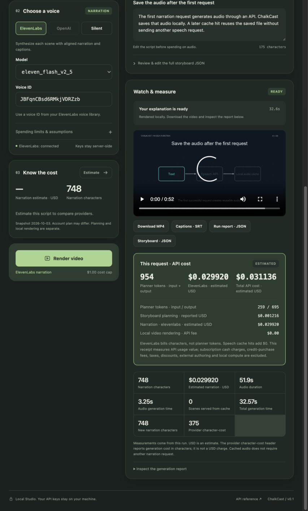
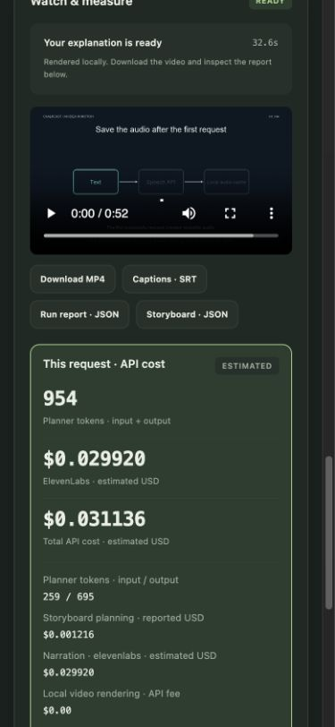

# Request cost receipt: a live demonstration

On 2026-10-04, the Studio planned a caching explainer through OpenRouter, then rendered a human-reviewed script with ElevenLabs Flash. The original draft contained unsupported numerical benefit claims and generalized per-request pricing; review removed those claims and specified the actual cache inputs and character billing before synthesis.

| Measurement | First video request | Cached repeat |
|---|---:|---:|
| Planner input / output tokens | 259 / 695 | 0 / 0 |
| Total planner tokens | 954 | 0 |
| Reported planner USD | $0.0012156 | $0 |
| New narration characters | 748 | 0 |
| ElevenLabs USD, list-rate estimate | $0.029920 | $0 |
| Total API usage value | $0.0311356 estimated | $0 |
| Scene cache hits | 0 / 4 | 4 / 4 |
| Local generation wall time | 32.569 s | 29.579 s |

The first video is 52.000 seconds; measured audio is 51.905 seconds. Repeated video generation still spends local encoding time, even when speech costs zero. A CLI run also automatically attached the already allocated planner sidecar: original 954 tokens remained inspectable while incremental planning tokens/cost were zero.

The dollar total adds OpenRouter's reported usage value to an estimate of newly generated speech: `0.0012156 + 748 / 1000 * 0.04 = 0.0311356`. The ElevenLabs dollar invoice remains **unknown**; its raw character-cost telemetry is not dollars. Included balance and account mode can change cash charges. See [the accounting scope](costs.md#a-cost-receipt-for-every-video-request).

The browser verified result downloads, receipt reopening after a server restart, and a 390-pixel mobile viewport without horizontal overflow. Offline tests cover distinct drafts, concurrent fee allocation, restart reuse, missing/invalid cost fields, partial failures and paid invalid storyboards. Runtime artifacts, credentials and provider identifiers stay outside git. [Sanitized measurements](assets/request-costs.json).

